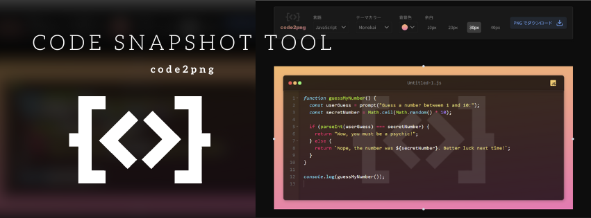

  

    
    
    
    
    
    
  

  <h3 align="center">Code Snapshot Tool</h3>

  

    コード画像変換ミニアプリ
  

## 📋 <a name="table">もくじ</a>

1. 🤖 [はじめに](#intro)
2. 🔗 [URL](#url)
3. 🔋 [ミニアプリの機能](#feature)
4. 🚀 [アプリの利用サンプル](#example)
5. 💻 [画面サンプル](#screen_sample)
6. 🤸 [終わりに](#outro)

## <a name="intro">🤖 はじめに</a>

エディタに入力したコードを画像化してダウンロードできる、code2png を紹介します。

## <a name="url">🔗 URL</a>

code2png | Code Snapshot Tool  
https://code2png.vercel.app

## <a name="feature">🔋 ミニアプリの機能</a>

### 設定切替機能

- 🫦 言語の切り替え
- 🪶 テーマの切り替え
- 🌄 背景色の切り替え
- 👩‍🦯 余白の切り替え

### コードエディタ

- 🤏 縦横幅リサイズ機能
- 📃 ファイル名編集機能
- 🧮 行番号表示
- 🧱 コードブロック折り畳み
- ✏️ コード編集機能

### ダウンロード機能

- 📥 エディタの表示内容を画像に変換してダウンロード

## <a name="example">🚀 アプリの利用サンプル</a>

##### code2png 操作デモ
<!-- ./images/code2png_demo.mp4 -->
<video src="https://github.com/user-attachments/assets/8e1b9099-2c7f-4e5f-afee-aa93b12a5c37" controls="true"></video>

##### Python サンプルコード画像変換
<!-- ./images/code2png_python.mp4 -->
<video src="https://github.com/user-attachments/assets/702175ec-d0d2-4023-b661-aef60293928f" controls="true"></video>

## <a name="screen_sample">💻 画面サンプル</a>

#### 初期表示 

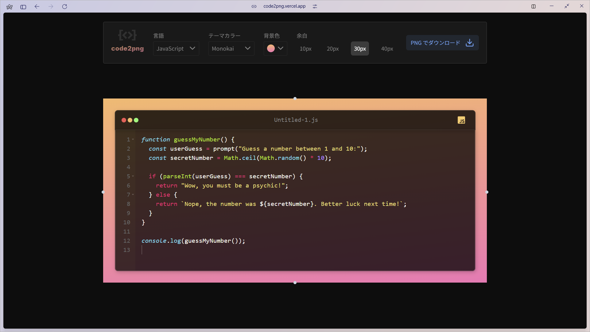

### ヘッダ部

#### 言語切り替え

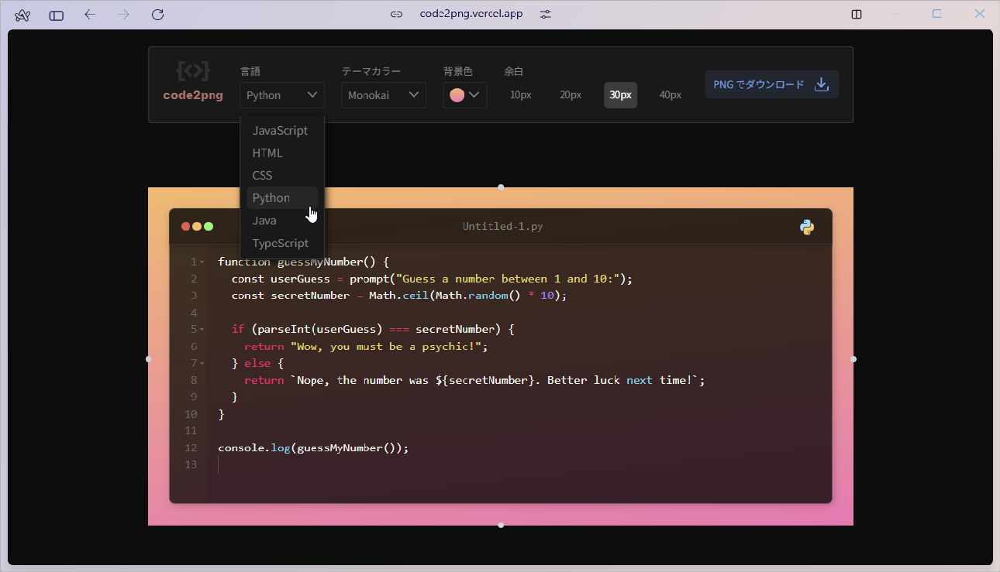

#### テーマカラー切り替え

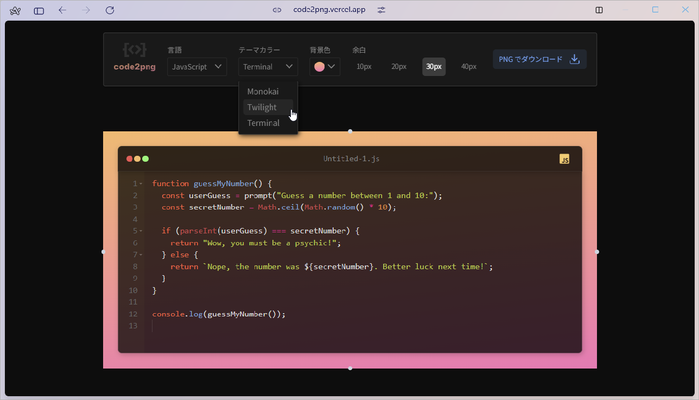

#### 背景色切り替え

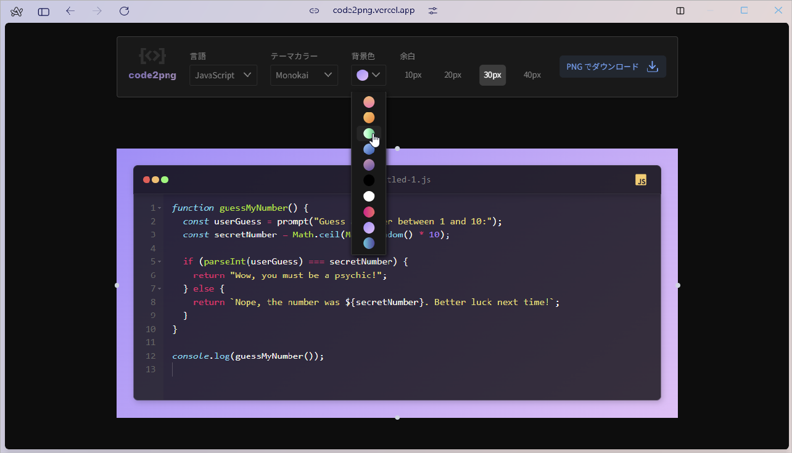

#### 余白変更（余白小）

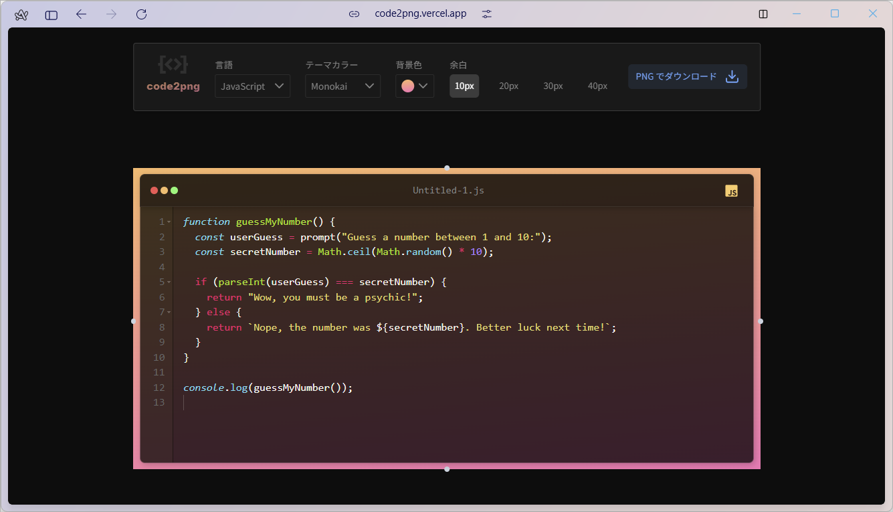

#### 余白変更（余白大）

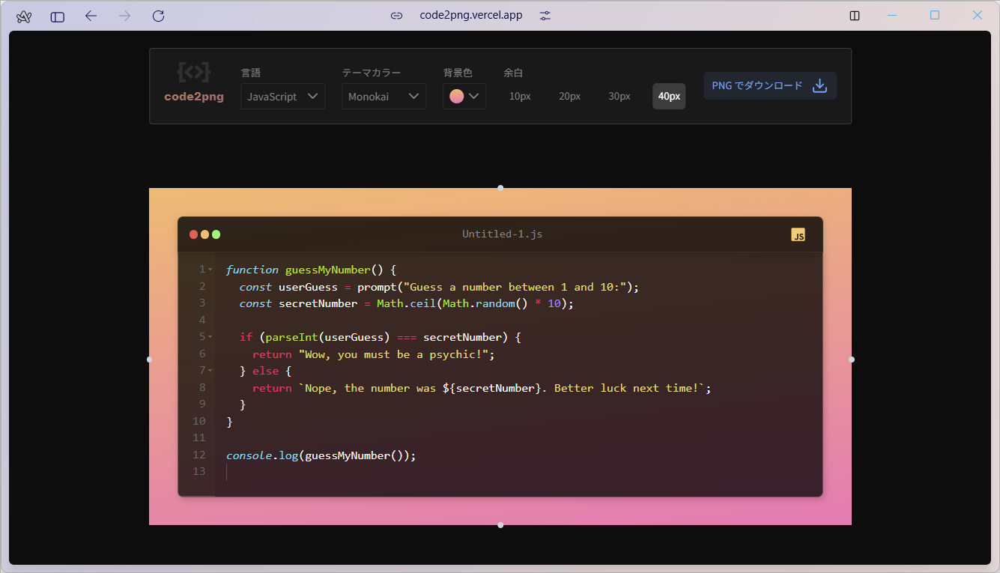

### エディタ部

#### リサイズ（横幅）

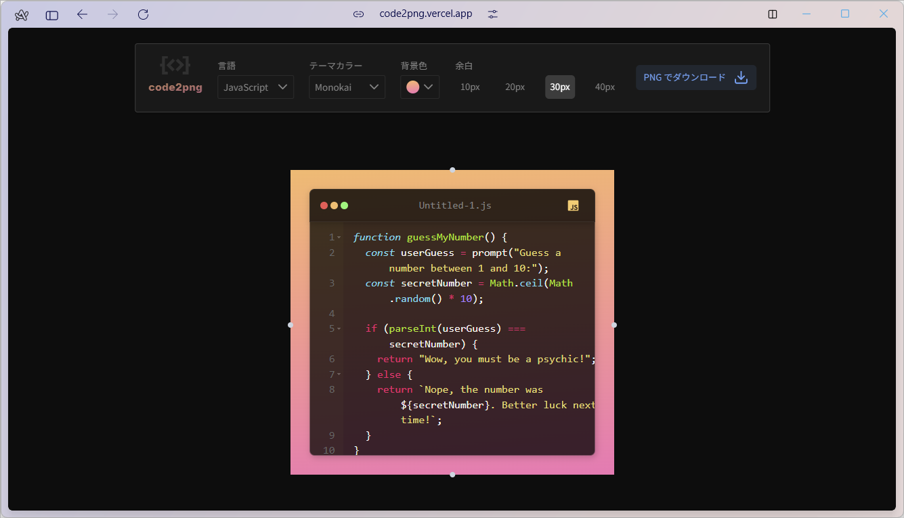

#### リサイズ（縦高さ）

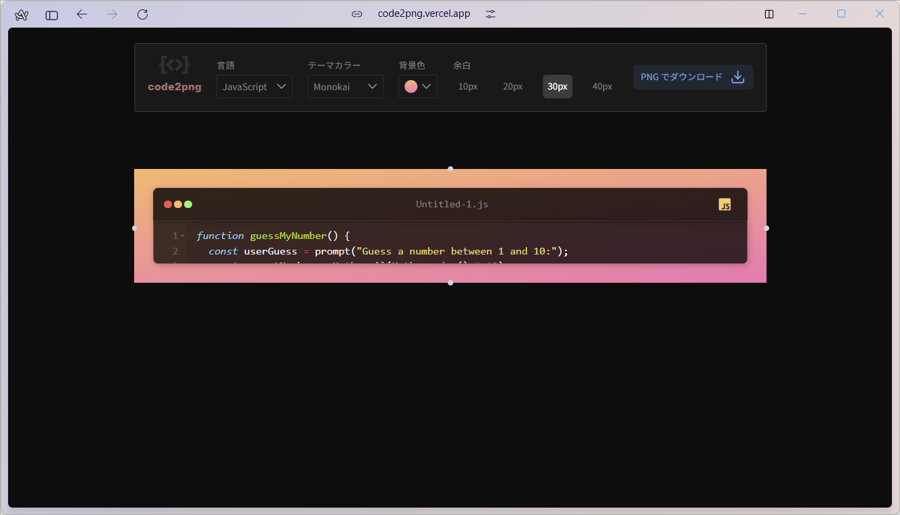

#### ファイル名変更

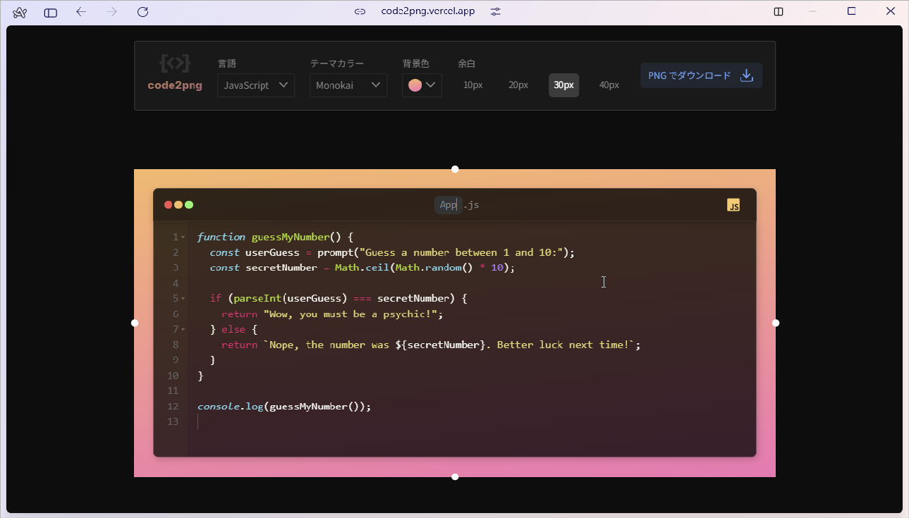

#### コードブロックの折りたたみ

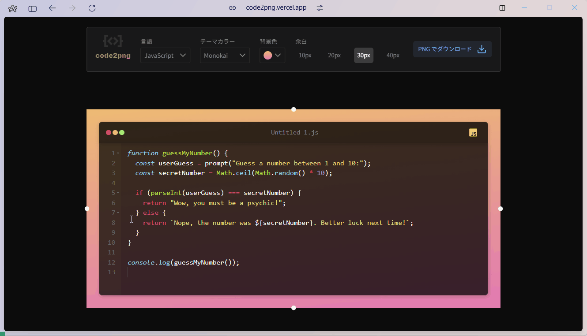

#### コード編集

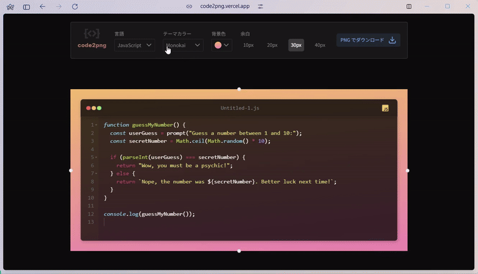

### 画像変換・ダウンロード

#### PNG ファイル形式でダウンロード

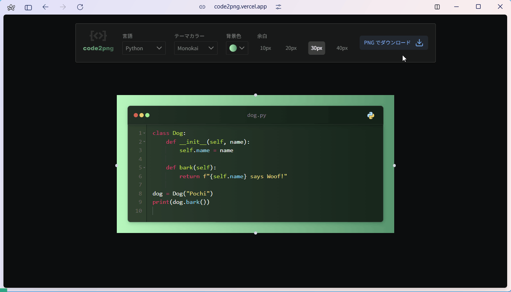

#### ダウンロード結果

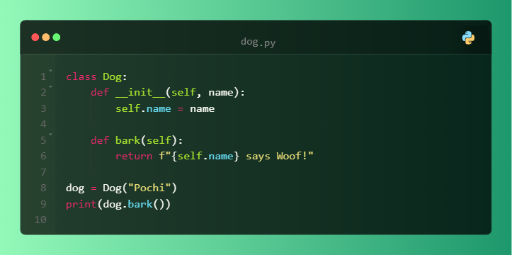

## <a name="outro">🤸 おわりに</a>

今回はミニアプリとして、コードを画像変換してダウンロードする、code2png を紹介しました。

こうした切替、編集、画像変換ダウンロードする機能は、大きなアプリのひとつの機能として組み込んだり、応用したりすることができます。
